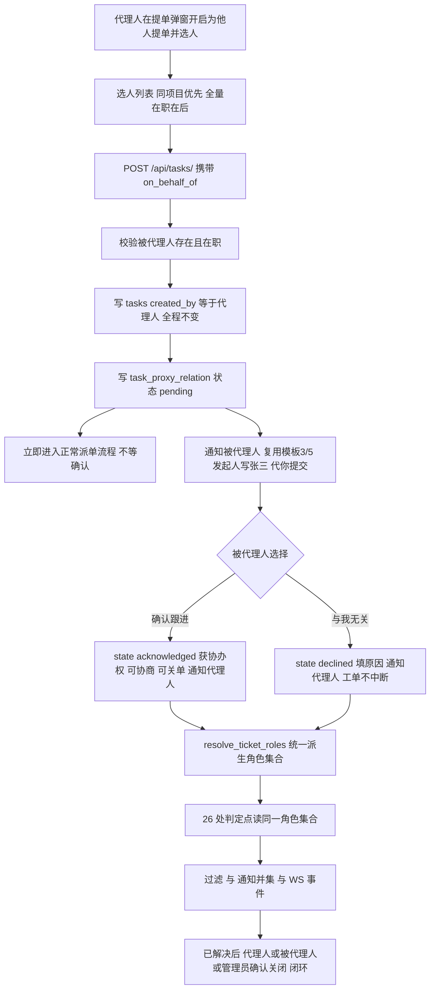

# 代他人提单（代理提单）功能设计方案

> 版本：v2.0（已定稿，开始实施）
> 范围：摇人吧工单系统 —— 支持"代他人提单"并形成全链路闭环（代提 → 通知 → 跟进 → 协同 → 闭环）
> 说明：本文基于当前代码实测整理，涉及现状的结论均标注文件与行号。

---

## 1. 需求与目标

### 1.1 典型业务场景

| # | 场景 | 举例 |
|---|------|------|
| 1 | 现场人员无法自主提单 | 现场操作员不会用手机、在产线上腾不出手，实施工程师代其提单 |
| 2 | 电话/微信语音报障 | 客户打电话报障，客服或工程师代为录入工单 |
| 3 | 代客户提需求 | 项目经理代甲方现场提功能需求单 |
| 4 | 上级代下级提单 | 领导发现现场问题，代当天值班人员提单 |

共同点：**实际操作人（代理人）与问题归属人（被代理人）不是同一个人**，且被代理人必须是能"接住这张单"的人（要能收到提醒、能跟进、能确认关闭）。

### 1.2 功能目标

1. 支持在提单时选择"为他人提单"，指明被代理人；
2. 代提后**被代理人能收到提醒**（微信模板消息 + 站内实时）；
3. 被代理人能**选择跟进**（确认跟进 / 与我无关），确认后获得协办权，语义见 §3.2；
4. 形成"代理人 — 被代理人"的稳定关系，在工单全生命周期可见、可审计；
5. **全链路闭环**：提单 → 派单 → 处理 → 讨论 → 解决 → 确认关闭，双方都在链路上，不出现"无人认领"或"代理人提了单但被代理人不知情"的断点。

### 1.3 非目标（本期不做，列入后续迭代）

- **接手（被代理人把工单转为自己名下）**：与"关系一对一、创建时确定、全程不变"约束互斥，本期砍掉（详见 §3.2）；
- 长期委托授权关系（"以后我提的单都算李四的"）→ 见 §5.5 方案四；
- 无系统账号的外部人员（无 openid、无账号）的短信/电话通知通道 → 本文 §5.6 明确列为不可行降级；
- 工单归属权的批量转移、统计口径的历史重算 → 需另立专项。

---

## 2. 已锁定决策（12 条）

| # | 议题 | 结论 |
|---|---|---|
| 1 | 被代理人可选范围 | **全量在职用户**（不做项目收敛） |
| 2 | 选人列表排序 | **同项目优先 → 全量在职在后**（两段分组，后端显式返回 `group` 标记） |
| 3 | 跟进权限档位 | **协办**：确认后可评论、可被 @、可催办、可补充信息、可确认关闭、参与回合协商 |
| 4 | 被代理人确认后能否撤回工单 | **不可撤回**；撤回权仍只属于实际提交人（`created_by`） |
| 5 | 「已解决 → 已关闭」执行人 | **代理人 + 被代理人 + 管理员** 均可 |
| 6 | `tasks.customer` 处理 | **收敛为纯展示用「联系人」自由文本**（允许非注册用户）；关单/确认判定改由 `created_by` + 代理关系 principal 派生；顺带修掉"新单 customer 为空导致非 admin 关不掉单"的既存口径不一致 |
| 7 | 回合协商 side（侧别） | **被代理人算 creator 侧**（与代理人同侧，代表问题方） |
| 8 | 技术路线 | **方案二：关系表 `task_proxy_relation`**；`tasks.created_by` 语义保持不变（= 代理人） |
| 9 | 派单时机 | **不等确认，立即派单**（沿用现状 60s Worker 轮询，不改节奏） |
| 10 | 未确认期间被代理人权限 | **只读**：可查看、可评论；不可改状态、不可撤回、不参与回合协商 |
| 11 | 接手 | **砍掉**。关系一对一、创建时确定、全程不变；无 `transferred` / `revoked`，状态机 3 态 |
| 12 | 微信模板 | **一期复用现有模板 3/5**（「发起人」字段写「张三（代你提交）」），零公众号审核即可上线 |

---

## 3. 方案设计

### 3.1 方案选型对比（结论：方案二）

| | 做法 | 改动量 | 最大问题 |
|---|---|---|---|
| **〇 复用 `customer`** | 被代理人写进 `customer` | ~0 | 语义污染 + 撤回权拿不到 + 无"同意"状态可挂 → **不投产** |
| **一 双字段最小改造** | `tasks` 加 `on_behalf_of`/`submitter_id`，`created_by` 改为**被代理人** | ~4 人天 | 被代理人零改造继承全部提单人权益，但 `created_by` 是全局权限锚点，改语义波及统计口径与 AI 派单的"发起人"标签；且只支持一对一、无同意流程 |
| **二 关系表（★ 采用）** | 新表 `task_proxy_relation`，`created_by` **不动** | ~7.5 人天 | 需在 26 处权限判定点 + 列表过滤 + 通知对象接入参与人解析，改动点多但语义最干净 |
| **三 通用参与人表** | `task_participant(role=creator/agent/cc/follower)` 全量改造 | ≥20 人天 | 回归面覆盖过滤/通知/@名单/WS/统计，**不建议一次性落地**，定位为方案二的下一代 |
| **四 长期委托** | `user_delegation` 表 | 增量 | 本期不做，方案二已预留字段 |

**为什么选方案二**：关系表天然承载完整闭环状态机，且 `created_by` 语义不变 → 存量自提单零行为变化，回归风险可控。

### 3.2 关系状态机（3 态）

```text
pending ──┬─ acknowledged（确认跟进 → 获协办权，参与协商与关单）
          ├─ declined（与我无关，需填原因 → 通知代理人，工单不中断，代理人兜底）
          └─ （自然终结：被代理人离职/注销，非用户操作）
```

**关键语义说明**：

- **无 `transferred`（接手）**：接手 = 更换提单人，与"代理人确定、被代理人不会中途更换"的约束互斥，已砍掉。
- **无 `revoked`（用户操作层撤销）**：关系一旦建立不被主动撤销，只按生命周期自然终结。
- **`declined` 是终态但工单不中断**：被代理人拒绝后关系记录保留，代理人的 `created_by` 身份不受任何影响（他本来就是提单人）。"拒绝"不是甩锅，只是"我不参与"。
- **`pending ≠ 无权限`**：`pending` 期间被代理人可查看、可评论（决策 10），只是不可改状态、不参与协商。前端必须做视觉区分，否则会出现"按钮点不动但看着像坏了"。

### 3.3 数据模型

**新表 `task_proxy_relation`**：

| 列 | 类型 | 说明 |
|---|---|---|
| `id` | BigInteger PK | |
| `task_id` | BigInteger FK tasks.id | 关联工单 |
| `agent_id` | String(50) | 代理人 users.id |
| `agent_username` | String(100) | 代理人 username（双键兜底） |
| `principal_id` | String(50) | 被代理人 users.id |
| `principal_username` | String(100) | 被代理人 username（双键兜底） |
| `relation_status` | String(20) | `pending` / `acknowledged` / `declined` |
| `source` | String(20) | `manual` / `ai` / `admin` |
| `remark` | String(500) | 拒绝原因（declined 时必填） |
| `notified_at` | DateTime | 首次通知被代理人时间 |
| `acked_at` | DateTime | 确认跟进时间 |
| `declined_at` | DateTime | 拒绝时间 |
| `created_at` / `updated_at` | DateTime | |

**约束**：

```sql
UNIQUE KEY uk_task_agent_principal (task_id, agent_id, principal_id)   -- 防重复代提
KEY idx_principal_status (principal_id, relation_status)               -- 支撑「待我跟进」
KEY idx_task_id (task_id)                                              -- 列表批量归并
```

**预留字段（为方案四长期委托平滑升级）**：`scope` / `valid_until` / `delegation_id`。

**为什么用独立表而非 `tasks` 加两列**：虽是 1:1 语义，但需要审计留痕（状态变更时间线）与后续扩展性；且独立表在"一人代多单"的查询上更自然。

### 3.4 统一角色解析（本次最关键的工程动作）

把散落在前后端约 **26 处**的身份判定收敛为**单一出口** `resolve_ticket_roles()`：

```python
@dataclass
class TicketRoles:
    is_creator: bool      # tasks.created_by（= 代理人，全程不变）
    is_assignee: bool     # tasks.assigned_to
    is_principal: bool    # task_proxy_relation.principal_id 且 status == 'acknowledged'
    is_agent: bool        # task_proxy_relation.agent_id
    is_pending_principal: bool  # status == 'pending'，只读态
    is_customer: bool     # tasks.customer，仅展示用，不再参与权限
    is_admin: bool
    can_operate: bool     # backend:tasks:operate
    side: Optional[str]   # 'assigned' | 'creator'；principal 归 'creator'（仅 acknowledged 时生效）
```

**为什么必须先收敛**：被代理人要参与的每个场景都落在不同判定点——列表看到单（前端 `ticketFilters.ts` + `my_tasks.py` + SQL 层）、收到提醒（通知并集）、关单（`api/task.py:860`）、催办（`:2358`）、协商回合（`_actor_side` + 前端 `myTurn`）、打回/推进阶段（`:1950` / `:1631`）、编辑问题文档（`spec_doc.py:69`）、操作日志身份（`operation_log_service.py:47-48`）。

**只在 `:860` 加 principal 判定的后果**：被代理人能关单，但看不到单、收不到通知、讨论区不认侧别、协商回合永远轮不到他 —— 比不改更糟。

### 3.5 项目与人员数据源现状

| 入口 | 项目字段 | 位置 |
|---|---|---|
| AI 转工单确认弹窗 | ✅ 有「绑定项目」（`ProjectSelect`，必选） | `frontend/src/shared/components/ChatPanel.tsx:3361-3372` |
| 系统任务手动建单弹窗 | ❌ **无项目字段**（只有标题/类型/优先级/描述/远程方式） | `frontend/src/pages/tasks/TasksView.tsx:1836-1893` |

两入口不一致 → 代提选人需要项目维度，**需在系统任务建单弹窗补 `ProjectSelect`**（`TasksView.tsx:719` 已在拉 `getMyProjects()`，组件现成）。

**新增选人接口**（现有接口均不满足）：

```text
GET /api/tasks/on-behalf-candidates?project_id=&keyword=
→ [{id, username, name, group: 'project' | 'all'}]
```

不满足的原因：`GET /api/tasks/{id}/project-members` 需要 `task_id`（提单时工单尚不存在）；`GET /api/tasks/assignable-users` 无项目参数。

**`group` 标记必须显式返回**：现有 `project-members?all=true` 顺序已是"项目成员 → 全量"，但项目成员段的 `role_name` 可能为空，前端无法靠它区分，只能靠位置猜，很脆。

---

## 4. 全链路设计

### 4.1 端到端时序



### 4.2 通知矩阵

| 事件 | 收件人 | 模板 | 文案要点 |
|---|---|---|---|
| 代提成功 | 被代理人 | 复用模板 5（新建工单） | 「发起人」字段写「张三（代你提交）」，明确代提关系 |
| 被代理人确认跟进 | 代理人 | 复用模板 3 | 「李四 已确认跟进本工单」 |
| 被代理人拒绝 | 代理人 | 复用模板 3 | 「李四 表示与本单无关：{原因}，请继续跟进」 |
| 派单完成 / 状态变更 / 被 @ / 已解决 | 代理人 + 被代理人 | 模板 3/8/2 | 按各自角色措辞 |
| 被代理人离职 | 代理人 | 复用模板 3 | 关系自然终止提示 |

**通知收件人并集**从 `created_by + assigned_to + customer` 扩展为 **`created_by + assigned_to + customer + principals`**（`ticket_service.py:777-784`、`1042-1046`）。

**微信下发硬约束**：依赖 openid，`wechat/api/message.py:98-108` 对无 openid 直接判 `NO_OPEN_ID` 跳过 → **被代理人必须是注册在职用户**；全仓**无短信、无邮件**通道。

### 4.3 接口清单

```text
GET  /api/tasks/on-behalf-candidates?project_id=&keyword=   代提选人（返回 group: project|all）
GET  /api/tasks/{id}/proxy-relations                        查询关系（参与人可见）
POST /api/tasks/{id}/proxy-relations/{rid}/ack              仅 principal 本人，pending → acknowledged
POST /api/tasks/{id}/proxy-relations/{rid}/decline          仅 principal 本人，需原因，pending → declined
GET  /api/tasks/my-followups/count                          待我跟进角标
POST /api/tasks/                                            TicketCreate 增 on_behalf_of
```

**安全要求**：每个端点必须同时校验**身份 + 归属**；关系端点一律以 token 身份为准，**不信任前端传入的 `principal_id`**。

### 4.4 前端交互

1. **建单弹窗「为他人提单」行**：描述项之后，一行标签 + 品牌色开关；开启后展开选人入口（分两段分组），选中后主色软底胶囊展示「代 张三 提交」+ 清除按钮；下方浅底提示条说明「本单将以对方名义建立，对方会收到提醒」。
2. **代提选人分组**：面板两段——「同项目」在上、「其他在职人员」在下，段标题 12px 次级灰；段内按姓名排序；无同项目人员时该段隐藏，不显示空标题。
3. **工单详情页关系横幅**：状态标签与标题之间，毛玻璃卡片（`.surface-card`）+ 左侧 3px 主色竖条。代理人视角「你代 李四 提交」+ 状态胶囊；被代理人视角「张三 代你提交了本工单」+ 主按钮「确认跟进」/ 次按钮「与我无关」；`acknowledged` 后转弱化只读态「你已确认跟进」。
4. **列表卡片关系标签**：状态与优先级标签同行尾追加小号胶囊「代 李四」；`pending` 关系在卡片右上角显示品牌色圆点角标。
5. **「待你跟进」底部导航角标**：复用现有角标样式（18px 高、胶囊圆角、主色底、白字、10px 加粗），计数来源为待确认关系数。
6. **拒绝对话**：底部弹出面板，含原因输入 + 两个按钮；**不使用浏览器原生弹窗**（微信 H5 禁用 `alert/confirm/prompt`）。
7. **关系状态胶囊配色**：待确认 = 主色软底 + 主色文字；已跟进 = 浅绿软底；已拒绝 = 中性灰软底。同屏高度/圆角/字号统一。

---

## 5. 26 处身份判定收敛清单（实测枚举）

### 5.1 后端 `backend/app/modules/tasks/api/task.py`

| # | 行号 | 所属端点 | 现行判定 |
|---|---|---|---|
| 1 | 851 | 更新工单 `PATCH/PUT /{id}` | assigned_to / customer / created_by |
| 2 | 856 | 起单（new→） | created_by |
| 3 | 858 | 更新（pending/in_progress） | assigned_to |
| 4 | **860** | **关单（resolved→）** | **customer** ← 决策 6 改此 |
| 5 | 1028 | 删除工单 | assigned_to / created_by |
| 6 | 1391 | 改状态 `PATCH /{id}/status` | created_by / assigned_to |
| 7 | 1400 | 撤回（→canceled） | 仅 created_by |
| 8 | 1520 | 确认同意/响应 | assigned_to / created_by |
| 9 | 1631 | 完成当前阶段 | assigned_to |
| 10 | 1742-1744 | 协商（step negotiate） | assigned_to / created_by |
| 11 | 1876-1877 | 设置节点时间 | assigned_to |
| 12 | 1950-1951 | 打回工单 | created_by |
| 13 | 2244 | 修改创建人姓名 | assigned_to |
| 14 | 2358 | 重新派单 | assigned_to / customer / created_by |
| 15 | **247 / 249** | **`_actor_side()` 侧别判定**（被 263 / 923 / 1553 调用 3 次） | assigned_to ↔ created_by |
| 16 | 570 | 详情页派单理由脱敏 | created_by |
| 17 | 588 | 详情页派单理由 | 本轮 assigned_id |

### 5.2 后端其他文件

| 位置 | 作用 | 判定 |
|---|---|---|
| `tasks/api/spec_doc.py:69` | 问题文档读写权限 | created_by / assigned_to / customer |
| `call/api/my_tasks.py:80` | 摇人「我的任务」过滤 | created_by / assigned_to / customer |
| `tasks/services/operation_log_service.py:47-48` | 操作日志 `is_creator`/`is_assignee` 标记 | `same_identity` |
| `admin/services/task_dashboard_service.py:300` | 后台看板操作校验 | `same_identity(operator, assignee)` |
| `tasks/services/ticket_service.py:1131-1134` | **SQL 层**过滤（`resolved AND customer=我`） | 直接拼 SQL，不走 `user_matches` |
| `tasks/services/ticket_service.py:777-784` / `1042-1046` | 通知收件人并集 | 同属身份口径，需加 principal |

### 5.3 前端平行实现

| 位置 | 作用 |
|---|---|
| `shared/utils/userIdentity.ts:2` | 前端版 `isSameUser()` |
| `pages/tasks/TasksView.tsx:273-278` | `isCreator/isAssignee` + `myTurn` |
| `pages/tasks/TaskDetailPage.tsx:377-393` | `getCurrentUserRoles()` → `{isAssignee, isReporter}` |
| `pages/tasks/TaskDetailPage.tsx:414` | `resolved` 只对 `isReporter` 放开按钮 |
| `pages/tasks/TaskDetailPage.tsx:1080` | 问题文档可编辑判定 |
| `shared/components/StepNegotiationCard.tsx:17-20, 110-113` | `StepRoles` + `myTurn` |
| `shared/utils/ticketFilters.ts:55-63` | 相关性过滤 |

### 5.4 既存前后端不一致（决策 6 一并统一）

> `TaskDetailPage.tsx:414` 前端认为 `resolved` 操作归 **reporter（`created_by`）**；后端 `api/task.py:860` 判的是 **`customer`**。两套口径本来就不一致 —— 这解释了为什么"新单 `customer` 为空"时，**前端会显示按钮但后端 400**。

决策 6 落地时统一为：关单（resolved→closed）由 `created_by` + `principal(acknowledged)` + admin 判定。

### 5.5 `tasks.customer` 现状与收敛

**字面定义**：`String(100)`，模型注释只有四字"客户信息"（`models/task.py:87`）。**无外键、无枚举、无校验**。

**谁往里写**：

| 入口 | 是否写 `customer` |
|---|---|
| AI 转工单（`/qa/ticket/confirm`） | ❌ 联系人在 `ticket_dict_to_task_fields` 里落到 `metadata_info.contact`（`ai/core/task_adapter.py:148-154`） |
| 系统任务「+」新建工单弹窗 | ❌ 提交 payload 无 customer |
| 外部任务源同步（禅道/企微） | ❌ `backend/app/integrations/` 零引用 |
| `POST /api/tasks/` 直连调用方 | ✅ （`ticket_service.py:179`） |
| 详情页编辑（`PUT/PATCH /api/tasks/{id}`） | ✅ 可改 |

**历史数据**里装的是**提单人的微信 username/openid**（证据：`ai/agents/AiDiagnosisPlatform/assigner/eval/data/tickets.json` 中 `"customer": "wechat_oM1WF6s2nH"`）。

**它实际兼任 4 个职责**：

| 职责 | 位置 |
|---|---|
| ① 通知收件人 | `ticket_service.py:777-784`、`1042-1046` |
| ② 「待我确认的已解决单」 | `ticket_service.py:1131-1134`（`status=resolved AND customer=我`） |
| ③ **关单权判定** | `api/task.py:860` |
| ④ UI「联系人」展示 | `TicketDetailPage.tsx:848`、`TicketMonitor.tsx:179`、`ChatPanel.tsx:489` |

**结论：一个字段，三种身份，且已半失效**（新流程都不写它 → `:860` 的关单判定在新单上实际"永远不通过"）。

**本期收敛**：`customer` 降级为**纯展示用「联系人」自由文本**（允许非注册用户，如"王师傅 138xxxx"）；职责 ①③ 搬到 `created_by` + principal；职责 ② 改为按角色集合派生。

### 5.6 不可行降级（明确说明）

- **无账号外部人员无法接收提醒**：微信推送依赖 openid，无短信/邮件通道 → 被代理人必须是注册在职用户。若业务需要"代外部客户提单并通知客户"，本方案不支持，需另建通道。

---

## 6. 兼容性与后续演进

| 升级路径 | 兼容性 | 说明 |
|---|---|---|
| 方案二 → **方案三**（通用参与人表 `task_participant`） | **向前兼容，需一次覆盖式回归** | `task_proxy_relation` 本质是 `task_participant` 只装 `role ∈ {agent, principal}` 的特化。升级 = 表扩 `role` 列 + 判定点从"字段比较"改成"查参与人表" + 历史数据原地补 role，**不回滚数据** |
| 方案二 → **方案四**（长期委托 `user_delegation`） | **完全兼容，纯增量** | 新增 `user_delegation` 表 + 关系表加 `delegation_id`（已预留），不动已有逻辑 |
| 方案二 → 方案一（反向换方案） | ❌ **不兼容** | `created_by` 语义翻转，中途换等于重做 |

**关键**：必须在方案二落地时就把 26 处判定收敛到统一 helper，否则升级成本翻倍，且期间会持续出"某处忘了认 principal"的漏判 bug。

---

## 7. 实施分期

| 阶段 | 内容 | 参考工作量 |
|---|---|---|
| **P1** | 关系表 + ORM + 幂等建表 + 代提入参 `on_behalf_of` + 归属校验 + 审计 | ~2 人天 |
| **P2** | 统一角色解析 + 26 处判定收敛 + `customer` 关单权搬迁 + 列表/SQL 过滤 + 通知并集 + WS 事件 + 选人候选接口 | ~2.5 人天 |
| **P3** | 前端代提入口（含分组选人）、关系横幅、确认/拒绝交互、「待我跟进」角标与过滤条件 | ~3 人天 |
| **P4（二期）** | AI 对话识别「帮张三提个单」 | ~1 人天 |
| **P5** | 回归测试与上线 | ~1.5 人天 |

**P4 细节**：`ai/agents/AiDiagnosisPlatform/pipeline.py` 抽取 prompt 增 `on_behalf_of`；`ai/core/task_adapter.py` 落库前做姓名 → `users.id` 解析，解析不到则降级为普通提单，**不编造**。

---

## 8. 安全自检（对照《Security Rules V5》）

- **身份 + 归属双校验**：`ack`/`decline` 仅 `principal_id` 本人；`revoke`/`transfer` 已随接手砍掉，不存在。
- **不得信任前端传参**：`created_by` / `principal_id` 一律以 token 身份为准。
- **参数化查询**：100% 参数化；列表过滤新增字段必须进 `ticket_service.py:550-576` 的 `FIELD_MAPPING` 白名单，不接受任意字段名。
- **日志脱敏**：只记 `user_id`/`username`，**不落手机号等 PII**；对客户端返回通用错误，详情进服务端日志。
- **关系字段脱敏**：`GET /api/tasks/{id}` 与评论发布现状无归属校验，本批对代理关系字段做裁剪，非参与人不可见代理人/被代理人身份。

---

## 9. 验收清单

1. 被代理人必须是注册在职用户（后端校验，前端限选）；
2. 非关系参与人调用关系端点返回 403；
3. 同 `(task, agent, principal)` 重复代提幂等，不产生重复记录；
4. 被代理人确认跟进后：可评论/@/催办/确认关闭/参与协商；**不可撤回**；
5. `pending` 期间被代理人只读：可查看可评论，改状态/撤回/协商均被拒；
6. 关单（resolved→closed）代理人、被代理人、admin 均可；**修掉"新单 customer 为空导致非 admin 关不掉单"**；
7. 状态变更 / 被 @ / 已解决时，被代理人在通知收件人内；
8. 选人列表同项目人员排在前，且 `group` 标记正确；
9. 撤回（→canceled）仍仅限 `created_by`；
10. **存量自提单（无代理关系）行为与改造前完全一致**。

---

## 10. 附录 A：微信模板申请材料草案（二期用）

一期复用现有模板 3/5，**本附录仅供二期申请专属模板时使用**。

**模板标题**：工单待跟进提醒

| 参数 | 字段类型 | 含义 |
|---|---|---|
| `thing13` | thing（≤20 字） | 工单标题 |
| `thing8` | thing（≤20 字） | 项目名称 |
| `thing15` | thing（≤20 字） | 代提单人（"李四 代你提交"） |
| `time23` | time | 要求完成时间 |
| `const5` | const | 固定文案："请点击查看并确认是否跟进" |

**申请入口**：微信公众平台 `mp.weixin.qq.com` → 功能 → 模板消息（新版已并入订阅通知）→ 我的模板 → 新增。

**时效**：模板库内选用 = **即时生效无审核**；申请新增 = 官方口径 **1~3 个工作日**，且可能被驳回（行业不符 / 字段类型不合规）。

**二期落地方式（纯配置级替换）**：`backend/app/utils/template.yaml` 加一条模板 id + `notification_utils.py` 加一个组装函数，**不动数据模型/权限/前端**。

---

## 11. 附录 B：关键代码位置

| 内容 | 位置 |
|---|---|
| `tasks` 人员字段 | `backend/app/models/task.py:85-91` |
| 创建人取自 token | `backend/app/modules/tasks/api/task.py:303-308` |
| 创建工单服务 | `backend/app/modules/tasks/services/ticket_service.py:135-221` |
| 通知收件人并集 | `ticket_service.py:777-784`、`1042-1046` |
| SQL 层过滤 | `ticket_service.py:1131-1134` |
| 双键身份工具 | `backend/app/core/user_identity.py:23/66/83/94/104` |
| 微信下发与 openid 判定 | `backend/app/wechat/api/message.py:98-108` |
| 微信模板配置 | `backend/app/utils/template.yaml` |
| 前端相关性过滤 | `frontend/src/shared/utils/ticketFilters.ts:55-63` |
| 前端身份判定 | `frontend/src/shared/utils/userIdentity.ts:2` |
| 前端建单弹窗 | `frontend/src/pages/tasks/TasksView.tsx:1836-1893` |
| AI 转工单弹窗（含项目选择） | `frontend/src/shared/components/ChatPanel.tsx:3361-3372` |
| 工单详情页 | `frontend/src/pages/tasks/TaskDetailPage.tsx` |
