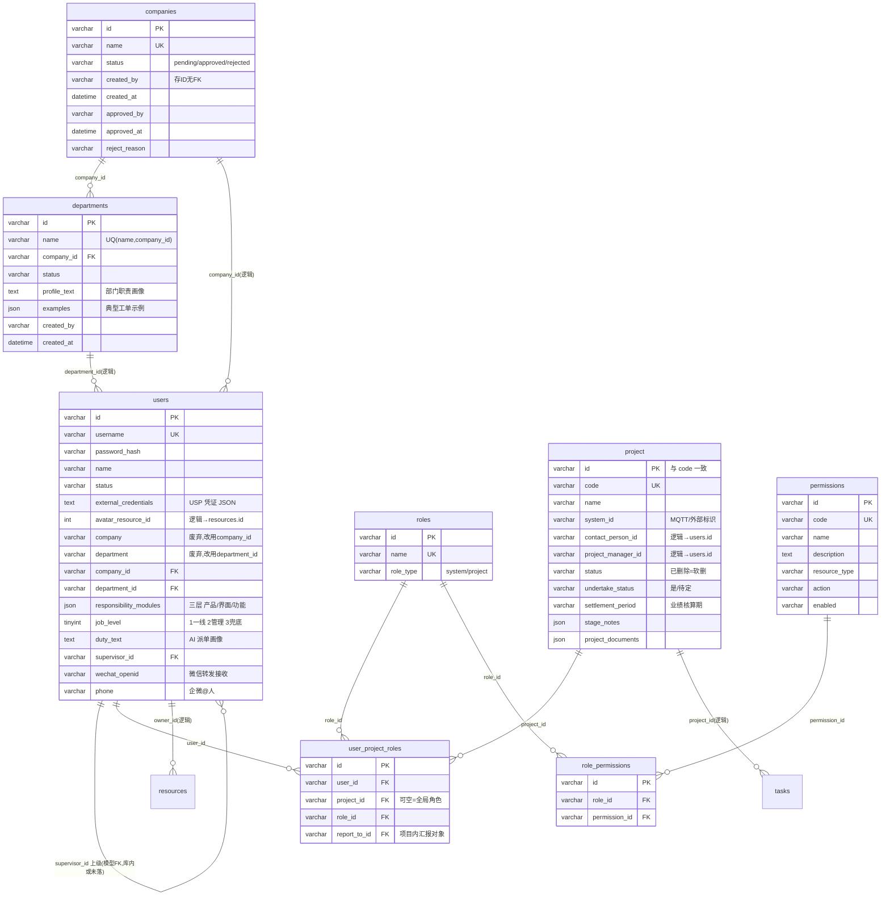
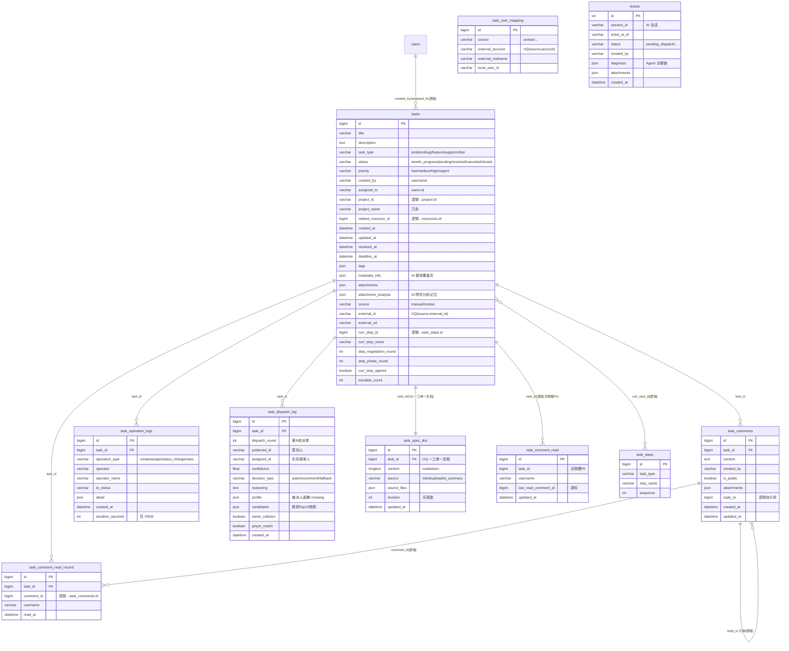
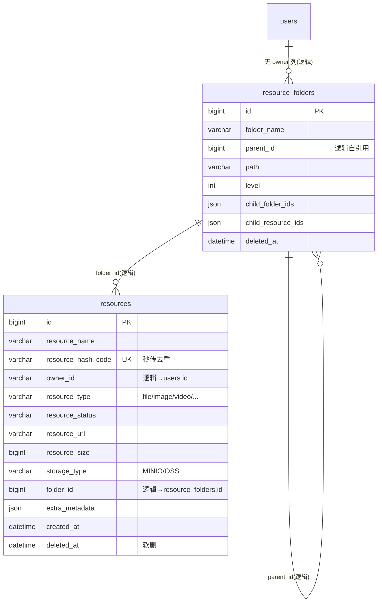
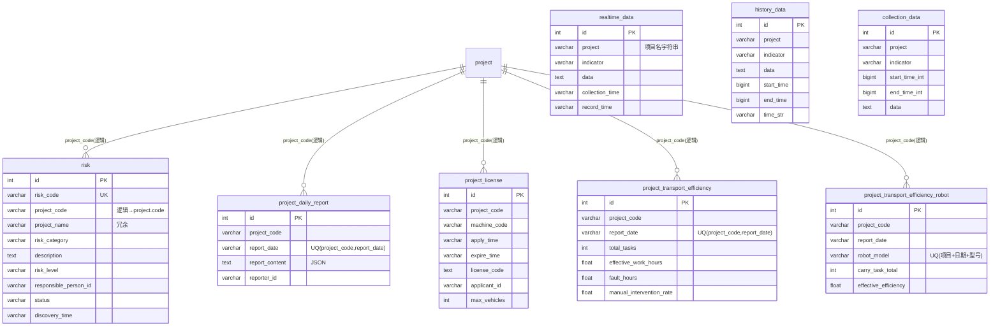
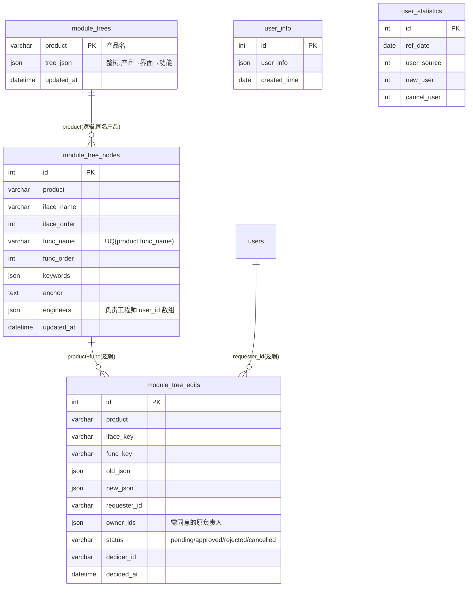

# 摇人吧（OpenRobotService）数据库关系模型（ERD）

> 生成方式：以代码中的 **ORM 真实定义**为准（唯一定义点 `backend/app/models/`），并与本地库 `helpdesk_7_16` 实测的 37 张表、14 条物理外键逐一核对。
> 生成日期：2026-09-14 ｜ 库：MySQL 8（字符集 utf8mb4） ｜ 时间字段统一 **naive UTC**

## 0. 数据来源与口径

| 项 | 说明 |
|---|---|
| ORM 唯一定义点 | `backend/app/models/`（`base.py` 单一 `declarative_base()`，Alembic 导入本包即注册全部模型） |
| 表总数 | **37 张**（与本地库 `information_schema` 实测完全一致） |
| 其他镜像模型 | `ai/core/database.py`、`co/db.py` 只是**只读投影**（users / tasks / project / risk / conversations / messages / user_project_roles），不额外建表 |
| 独立存储 | MinIO（对象存储，对应 `resources` 元数据）、Redis（会话/缓存）、Meilisearch（检索索引）、`app/kb/*.sqlite`（知识库），均非本 ERD 范围 |
| 关系口径 | 物理外键（DB 真实约束）与**逻辑外键**（代码里存 ID、无 DB 约束）分开标注——本项目大量关联是逻辑外键，这是读图时最关键的注意点 |

---

## 1. 总览：37 张表按域划分

| 域 | 表 |
|---|---|
| 身份 / RBAC（5） | `users`、`roles`、`permissions`、`role_permissions`、`user_project_roles` |
| 组织主数据（2） | `companies`、`departments` |
| 任务 / 工单（9） | `tasks`、`task_comments`、`task_comment_read`、`task_comment_read_record`、`task_operation_logs`、`task_steps`、`task_spec_doc`、`task_dispatch_log`、`task_user_mapping` |
| AI 历史工单（1） | `tickets`（AI 诊断生成，已逐步被 `tasks` 取代） |
| 对话 / 消息（4） | `conversations`、`messages`、`dataqa_conversations`、`dataqa_messages` |
| 资源（2） | `resources`、`resource_folders` |
| 交付项目 / 数据（9） | `project`、`risk`、`project_daily_report`、`project_license`、`project_transport_efficiency`、`project_transport_efficiency_robot`、`realtime_data`、`history_data`、`collection_data` |
| 责任模块树（3） | `module_trees`、`module_tree_nodes`、`module_tree_edits` |
| 统计 / 杂项（2） | `user_info`、`user_statistics` |

---

## 2. 分域 ER 图

### 2.1 身份 / RBAC / 组织 / 项目

### 2.2 任务 / 工单域（核心）

### 2.3 对话 / 消息域（摇人 + 数据助手，两套隔离）

```mermaid
erDiagram
    conversations ||--o{ messages : "conversation_id"
    messages ||--o{ messages : "parent_message_id(逻辑)"
    dataqa_conversations ||--o{ dataqa_messages : "conversation_id"
    dataqa_messages ||--o{ dataqa_messages : "parent_message_id(逻辑)"

    conversations {
        int id PK
        varchar title
        varchar user_id
        varchar scene_type "chat/faq/support/consultation/other"
        varchar service_ticket_id "关联工单"
        text metadata_
        datetime created_at
        datetime updated_at
    }
    messages {
        int id PK
        int conversation_id FK
        varchar role "user/assistant/system"
        varchar message_type "text/image/file/audio/multimodal"
        text content
        text file_urls
        int parent_message_id "逻辑自引用"
        int sequence
        datetime created_at
        text metadata_
    }
    dataqa_conversations {
        int id PK
        varchar title
        varchar user_id
        text metadata_
        datetime created_at
    }
    dataqa_messages {
        int id PK
        int conversation_id FK
        varchar role
        text content
        int parent_message_id
        int sequence
        datetime created_at
    }
```

### 2.4 资源域（MinIO 元数据）

### 2.5 交付项目 / 数据域

### 2.6 责任模块树（AI 派单主数据）+ 统计表

---

## 3. 关系总表（父子 + 基数 + 是否物理约束）

### 3.1 物理外键

模型声明共 16 处 `ForeignKey`；本地库 `information_schema` 实测落库 **14 条**（`users.company_id`、`users.department_id`、`users.supervisor_id` 中仅部分环境存在，见下方备注）：

| 父表 | 子表 | 关联字段 | 基数 | 删除行为 | 落库 |
|---|---|---|---|---|---|
| `users` | `user_project_roles` | user_id | 1:N | — | ✅ |
| `users` | `user_project_roles` | report_to_id | 1:N | — | ✅ |
| `roles` | `user_project_roles` | role_id | 1:N | — | ✅ |
| `project` | `user_project_roles` | project_id | 1:N | — | ✅ |
| `roles` | `role_permissions` | role_id | M:N | — | ✅ |
| `permissions` | `role_permissions` | permission_id | M:N | — | ✅ |
| `companies` | `departments` | company_id | 1:N | — | ✅ |
| `tasks` | `task_comments` | task_id | 1:N | CASCADE | ✅ |
| `tasks` | `task_comment_read_record` | task_id | 1:N | CASCADE | ✅ |
| `tasks` | `task_operation_logs` | task_id | 1:N | CASCADE | ✅ |
| `tasks` | `task_dispatch_log` | task_id | 1:N | CASCADE | ✅ |
| `tasks` | `task_spec_doc` | task_id | 1:1 | CASCADE | ✅ |
| `conversations` | `messages` | conversation_id | 1:N | CASCADE | ✅ |
| `dataqa_conversations` | `dataqa_messages` | conversation_id | 1:N | CASCADE | ✅ |
| `users` | `users` | supervisor_id | 1:N（自引用） | — | ⚠️ 模型声明，本地库未落 |
| `companies` | `users` | company_id | 1:N | — | ⚠️ 模型声明，本地库未落 |
| `departments` | `users` | department_id | 1:N | — | ⚠️ 模型声明，本地库未落 |

> 注：`users.company_id` / `users.department_id` 在**模型**里声明了 FK，但本地库实测未落物理约束（历史上手工加列），按逻辑外键处理更安全。

### 3.2 逻辑外键（代码存 ID、无 DB 约束，共 20 处——最易踩坑）

| 子表.字段 | 指向 | 说明 |
|---|---|---|
| `users.avatar_resource_id` | `resources.id` | 头像资源 |
| `users.responsibility_modules`（JSON） | 模块树 | 结构 `{产品:{界面:[功能]}}` |
| `companies.created_by / approved_by` | `users.id` | 刻意不建 FK，避免与 users 循环依赖 |
| `departments.created_by / approved_by` | `users.id` | 同上 |
| `tasks.created_by / assigned_to` | `users.id` | 存 username / id |
| `tasks.project_id` | `project.id` | 同时冗余 `project_name` |
| `tasks.related_resource_id` | `resources.id` | |
| `tasks.curr_step_id` | `task_steps.id` | 冗余 `curr_step_name / curr_step_endtime` |
| `task_comment_read.task_id` | `tasks.id` | **无物理 FK**，需应用层清理 |
| `task_comment_read_record.comment_id` | `task_comments.id` | 唯一键 (comment_id, username) |
| `task_comments.reply_to` | `task_comments.id` | 自引用（消息引用/回复） |
| `task_dispatch_log.preferred_id / assigned_id` | `users.id` | |
| `task_user_mapping.local_user_id` | `users.id` | |
| `task_spec_doc.created_by / updated_by` | `users.id` | |
| `conversations.service_ticket_id` | 任务 ID（字符串） | |
| `messages.parent_message_id` | `messages.id` | 自引用 |
| `resources.owner_id` / `resources.folder_id` | `users.id` / `resource_folders.id` | |
| `resource_folders.parent_id` | `resource_folders.id` | 自引用 |
| `risk / project_daily_report / project_license / *_transport_efficiency*.project_code` | `project.code` | 交付域普遍用 **code 字符串**关联，非 id |
| `module_tree_nodes.product`、`module_tree_edits.product` | `module_trees.product` | 产品名关联 |
| `module_tree_nodes.engineers`（JSON 数组） | `users.id` | 负责工程师 |

---

## 4. 设计要点速查（读图必看）

1. **任务是统一抽象**：`tickets`（AI 诊断旧表）与 `tasks`（现行工单表）并存，新代码一律用 `tasks`；`Task.ticket_type` 是 `task_type` 的兼容 property。
2. **两套「已读」互补**：`task_comment_read`= 每用户每工单游标（`last_read_comment_id`）；`task_comment_read_record`= 每条评论 × 每人的已读名单（飞书式）。二者不可互相替代。
3. **一工单一问题文档**：`task_spec_doc` 独立成表 + `revision` 乐观锁。原因：AI `upsert_task` 会整体覆盖 `tasks.metadata_info`，文档若塞进 metadata 会被反复覆盖。
4. **派单可审计**：`task_dispatch_log` append-only，一轮派单一行（含 Top10 候选快照、置信度、同名/拼音命中标记），前端只取 `dispatch_round` 最大的一条。
5. **交付域用项目 code 而非 id 关联**：`project.code` = `project.id`，风险/日报/License/运输效率表全部以 `project_code` 关联，且大量字段是字符串时间（`String(20/30)`），非 DATETIME。
6. **软删除三处**：`project.status='已删除'`（保留编号/名称占位）、`resources.deleted_at`、`resource_folders.deleted_at`。
7. **冗余字段是刻意的**：`tasks.project_name/curr_step_name`、`risk.project_name`、`project_transport_efficiency_robot` 的明细列——为免联表直接展示，改主数据时需同步。
8. **唯一约束清单**：`uq_task_source_external`(tasks)、`uq_task_read_user`、`uq_comment_read_user`、`uq_mapping_src_account`、`uq_task_spec_doc_task`、`uq_department_name_company`、`uq_module_tree_nodes_product_funcname`、`project.code`、`risk.risk_code`、`users.username`、`roles.name`、`permissions.code`、`resources.resource_hash_code`，以及交付域的 (project_code, report_date[+robot_model]) 组合唯一。

---

## 5. 关于 CodeQL

CodeQL 是**语义代码查询 / 漏洞审计**引擎（数据流 Source→Sink 分析），它的强项是找注入、越权等安全缺陷，**不适合**做 ER 模型抽取——它没有"ORM 实体—关系"的领域抽象，且建库（CodeQL database）对 Python 全仓需数十分钟，产出仍只是 AST/调用图，还得再写大量手写 QL 才能还原字段与关系，精度不如直接读 `declarative` 定义。

本项目数据库结构的**唯一可信来源**就是 `backend/app/models/`（`Base = declarative_base()` 单一 metadata），配合 `information_schema` 校验，结果如上。若确实需要"代码变更自动同步 ERD"，更合适的做法是：写一个脚本 import `app.models` → 遍历 `Base.metadata.tables` → 生成 Mermaid（比 CodeQL 短两个数量级且零误差）。需要的话我可以补这个生成器。
